## Use-of-artificial-intelligence-in-near-infrared-spectroscopy
This work has benefited from aid from the French State giving a favorable opinion from the government and which is part of a collaborative research initiative proposing to study the approaches relating to artificial intelligence, precisely that of the Deep Learning. It relies on a large dataset available online (https://esdac.jrc.ec.europa.eu/projects/lucas) and of which I would only study one part that will be necessary to achieve my goal which is to implement the Transfer Learning and testing its effectiveness in terms of performance, speed of convergence, and robustness.

### Near infrared spectroscopy (NIRS)

The frequencies that each medium absorbs
is specific to it, which allows the analysis of its composition and its properties

    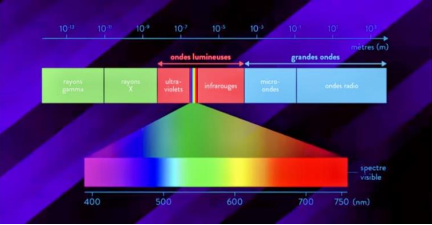 

The study of spectra is called spectroscopy. To study the composition of a
middle, we illuminate it with a continuous spectrum and we note the different wavelengths
absorbed from which one can deduce the elements present

    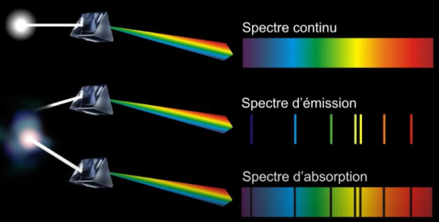 

The absorption of light at each of these wavelengths make up the “spectrum” of the sample. This spectrum can be made up of several hundred wavelengths for each of which we have measured the absorption of light.

### Signal processing Near infrared spectroscopy (NIRS)

The spectrum is characteristic of a sample because it gathers information (quantity
and characteristics) of each of its organic constituents (proteins, matter
fats, fibers, etc.). This wealth of information constitutes the advantage and the difficulty of
NIRS analysis: a lot of information is present in a spectrum, but it is
completely tangled! To overcome this difficulty, it is necessary to use
complex statistical methods, which will make it possible to link the spectra and the
chemical analyses: this is the `calibration` phase. Knowledge of the criteria
main characterization of the models makes it possible to quickly judge the quality of the
calibrations presented. Thereafter, we have the evaluation of the precision that we will have
during the practical use of the calibration which is the `validation`.

### Dataset

The NIRS has a large number of applications in the industrial field (chemistry,
pharmacy, agro-industries). For example, in the animal feed laboratory of the
CIRAD it is used to estimate the chemical composition of food samples,
fodder, products (meat), faeces (digestibility studies). Within the UMR
Agap Institute, it makes it possible to study the composition of sorghum grains, tubers
yams or rice leaves.

    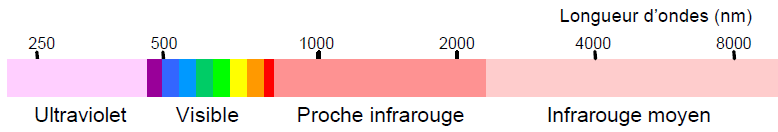 

For our study, the FildSpec Near IR Spectrometer (ADS) was used with the lengths
wave between 350 and 2500 nm. The spectrum obtained can be visualized by looking at
the curve of the absorbance of the sample as a function of wavelength. We obtain
the following spectrum for our samples

    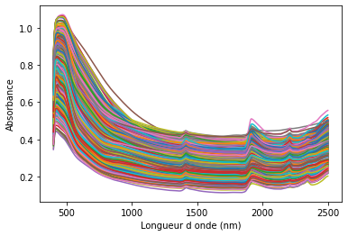 

For each dataset we used, we have the number of spectra as well
than the size in kilobytes:

    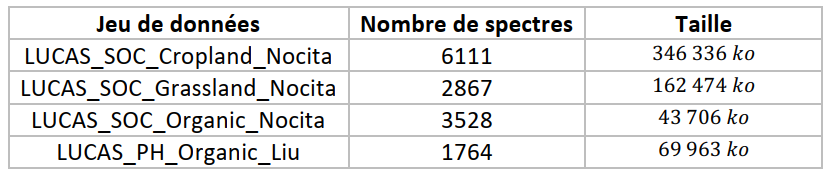 

LUCAS_SOC_cropland_Nocita is the learning game from which we will extract the weights
layers to transfer. It is used as a reference because it is the most common dataset.
complete (6111 spectra).
Each data set is divided into a calibration set (3/4 of the surrounding data) and a
validation dataset (1/4 of the data). The initial dataset split is performed using the Kennard-Stone algorithm. For LUCAS_SOC_Cropland_6111_Nocita for example, here are the generated files:

    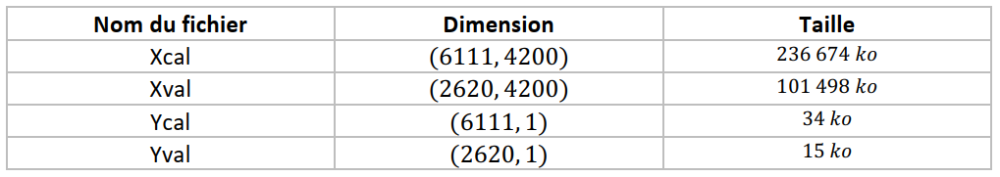 

### Model description

The model we used for this project is the convolutional neural network.
First, a convolutional neural network or convolutional neural network
(CNN) considered model-based machine learning tools
training data. They were developed by LeCun et al. in 1998 as a class
acyclic artificial neural networks (feed-forward). They are now one of
most important deep learning architectures, and they have been applied for
many tasks in different fields of research. It is a neural network
in which the connecting pattern between neurons is inspired by the visual cortex of
animals. Their operation is inspired by biological processes, they consist of a
multilayer stacking of perceptrons, the purpose of which is to preprocess small quantities
information. Experimental results conducted on spectroscopic data sets
show the interesting capabilities of 1D-CNN methods (CNN architectures at one
dimension) proposed. This network will take into account the application of 1D filters on the layers
convolution with the use of 1D input data.

CNNs architectures are the most used in learning approaches in depth. They are generally composed of an input layer, several hidden layers (convolution, pooling, and fully connected layers) and an output layer. 1D-CNN has an input layer and 1D filters on input layers. Convolution adapted to the one-dimensional spectrum of our data. In this study, we used the 1D-CNN architecture because the structure is simple and well described.

    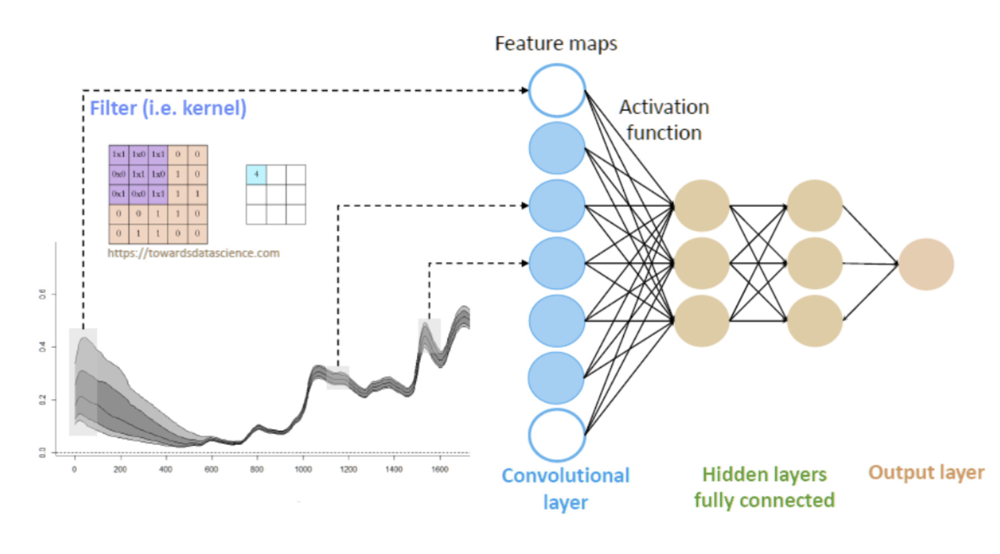 

### Results and discussion

This Project has three facets: one on the implementation of a Deep Learning code,
one on a performance analysis and finally one on the performance comparison
without and with Transfer Learning. This section is divided into three main parts which
describe.

#### General method

When training a network on a data set, this set must be divided into 2 parts: a
first for the learning phase (training), a second for the validation phase.
Indeed, it is possible for a network to over-learn the learning set. If so we do
predictions on this same game, the results will seem very good but when a
new dataset the results may have a clear difference. This phenomenon
is called overfitting, and to be able to detect it, we need the validation set
(so distinct from the learning game). Fortunately several effective techniques
exist to avoid overfitting, including: cross validation (cross validation in
French), Add training data, Remove features, Methods of
adjustments.
Unlike classic validation, where the data is divided in two, in cross
validation we divide the training data into several groups. The idea is then
to train the model on all the groups except one and to validate the training on this
latest. If we have 𝑘 groups, we will train the model 𝑘 times with each time a new
testing group. This cross-validation technique is called 𝑘 − 𝑓𝑜𝑙𝑑. We have
taken 𝑘 = 3. This technique helps to select the right machine learning models.

The use of all these techniques has allowed us to improve performance and with
the biggest dataset 𝐿𝑈𝐶𝐴𝑆_𝑆𝑂𝐶_𝑐𝑟𝑜𝑝𝑙𝑎𝑛𝑑 (of size 628 𝑀𝑜) we got
The following scores: $𝑅𝑀𝑆𝐸_𝐶𝑎𝑙𝑖𝑏𝑟𝑎𝑡𝑖𝑜𝑛 = 4.74$, 𝑅𝑀𝑆𝐸_𝑉𝑎𝑙𝑖𝑑𝑎𝑡𝑖𝑜𝑛 = 3.88, 𝑅2_𝐶𝑎𝑙𝑖𝑏𝑟𝑎𝑡𝑖𝑜𝑛 = 0.91, 𝑅2_𝑉𝑎𝑙𝑖𝑑𝑎𝑡𝑖𝑜𝑛 = 0.70.

#### Transfer learning

Transfer learning is one of the research fields of
machine learning which aims to transfer knowledge of one or more tasks
sources to one or more target tasks. These are skills learned from
previous tasks used to improve similar new tasks. Transfer learning
makes it possible to realize significant benefits, in terms of time and techniques
of learning. These benefits are also based on fine tuning in Transfer learning. The fine
tuning allows specific settings during the Transfer learning method, allowing
to make gradual adjustments and to freeze certain weights of the pre-trained model. the
following table shows us the weights of the different layers of our basic model that
we can train and those we cannot.

    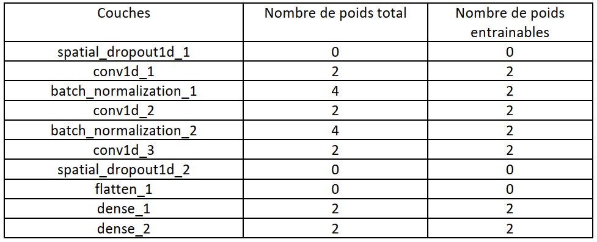 

The idea being to start from the largest dataset containing more information
𝐿𝑈𝐶𝐴𝑆_𝑆𝑂𝐶_𝑐𝑟𝑜𝑝𝑙𝑎𝑛𝑑 and then train the neural network sufficiently with this game
of data so that the layers are dedicated to processing the signal as needed. Once the processed signal, the weights are transferred for all future calibrations in order to study the performance, convergence speed, and robustness.

#### Results

We trained our four datasets with our base model. Subsequently, we
have carried out Transfer learning from 𝐿𝑈𝐶𝐴𝑆_𝑆𝑂𝐶_𝑐𝑟𝑜𝑝𝑙𝑎𝑛𝑑 to the other three dataset having less observations 

##### 1) Transfer learning without re-training the first convolution layers

Using the same network with which we obtained the optimal values of the largest
dataset, we obtain the following curves describing the evolution of the 𝑙𝑜𝑠𝑠 as a function
the number of epochs on the one hand without Transfer learning and on the other hand with Transfer learning
without re-training the first convolution layers for the three values of the 𝑘_𝑓𝑜𝑙𝑑 for
the other three species

a) 𝑳𝑼𝑪𝑨𝑺_𝑺𝑶𝑪_𝑮𝒓𝒂𝒔𝒔𝒍𝒂𝒏𝒅_𝟐𝟖𝟔𝟕_𝑵𝒐𝒄𝒊𝒕𝒂

    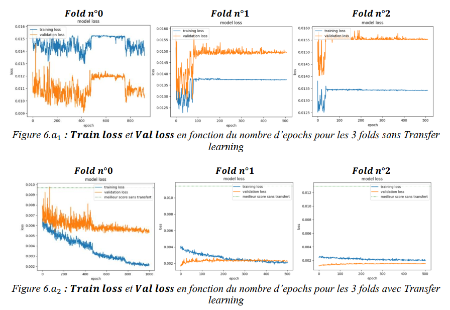 

A good fit is the goal of the learning algorithm and exists between a model of
over-adjustment and under-adjustment. A good fit is identified by a loss
training and validation that decreases to a point of stability with a deviation
minimum between the two final loss values. In Figure 6.𝑎1 the gaps between the two
are much larger than those in Figure 6.𝑎2. We also observe a
rapid convergence during Transfer learning (Figure 6.𝑎2) and therefore learning is more
fast in this case. On the other hand, all learning transfer curves are below the
best score without transfer which is 𝟎. 𝟎𝟎𝟗𝟕 for the first fold, 𝟎. 𝟎𝟏𝟏𝟒 for the
second fold and 𝟎. 𝟎𝟏𝟐𝟗 for the third fold this for the 𝑣𝑎𝑙𝑖𝑑𝑎𝑡𝑖𝑜𝑛 𝑙𝑜𝑠𝑠. We observe
all the same a slight overflow around 92 epochs for the first fold but which remains
negligible. This explains a better performance of the model with transfer learning for
LUCAS_SOC_Grassland_2867_Nocita.

b) 𝑳𝑼𝑪𝑨𝑺_𝒑𝑯_𝑶𝒓𝒈𝒂𝒏𝒊𝒄_𝟏𝟕𝟔𝟒_𝑳𝒊𝒖

    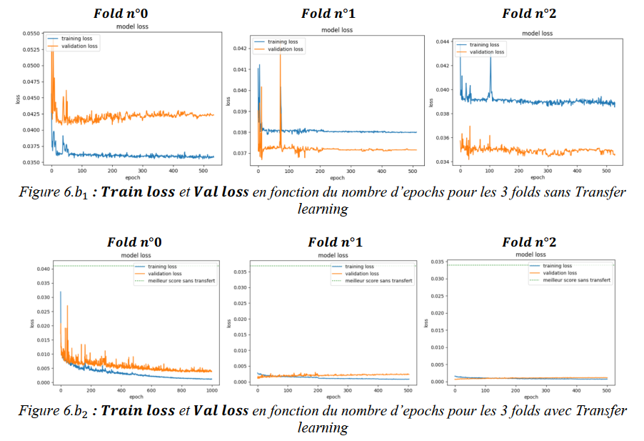 

We also have the different deviations with the base model in Figure 6.𝑏1 for
the three folds. This gap decreases considerably when we apply the Transfer
learning Figure 6.𝑏2 and learning is faster. All learning transfer curves
for the 𝑣𝑎𝑙𝑖𝑑𝑎𝑡𝑖𝑜𝑛 𝑙𝑜𝑠𝑠 are below the best score without transfer which is 𝟎. 𝟎𝟒𝟏𝟎
for the first fold, 𝟎. 𝟎𝟑𝟔𝟖 for the second fold and 𝟎. 𝟎𝟑𝟑𝟗 for the third fold. This
explains a better performance of the model with transfer learning for
𝐿𝑈𝐶𝐴𝑆_𝑝𝐻_𝑂𝑟𝑔𝑎𝑛𝑖𝑐_1764_𝐿𝑖𝑢.

c) 𝑳𝑼𝑪𝑨𝑺_𝑺𝑶𝑪_𝑶𝒓𝒈𝒂𝒏𝒊𝒄_𝟑𝟓𝟐𝟖_𝑵𝒐𝒄𝒊𝒕𝒂

    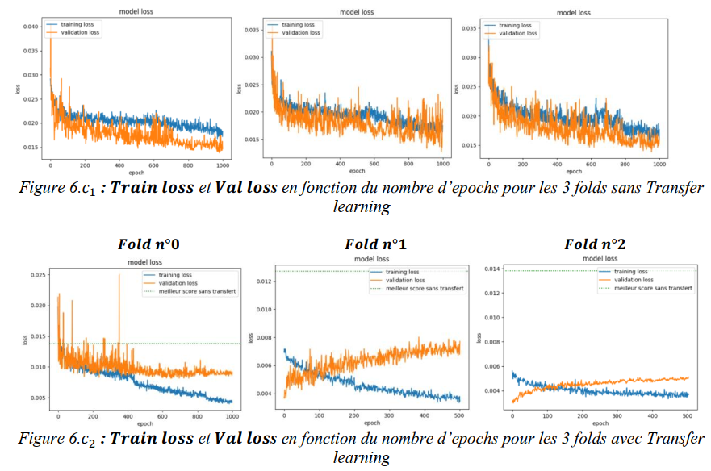 

Here the difference between the two scores is not very great with the basic model for the
three folds see Figure. 6.𝑐1. For the first fold in Figure 6.𝑐2 some values of the
𝑣𝑎𝑙𝑖𝑑𝑎𝑡𝑖𝑜𝑛 𝑙𝑜𝑠𝑠 exhibit the best performance (i.e. 𝟎. 𝟎𝟏𝟑𝟖 is less than
certain values after transfer) but globally the model with transfer converges towards the
superior performance to the base model. Regarding the other two folds, All
learning transfer curves for the 𝑣𝑎𝑙𝑖𝑑𝑎𝑡𝑖𝑜𝑛 𝑙𝑜𝑠𝑠 are below the best score without
transfer which is equal to 𝟎. 𝟎𝟏𝟐𝟕 for the second fold and 𝟎. 𝟎𝟏𝟑𝟖 for the third fold.

##### 1) Transfer learning by freezing the intermediate layers: comparison with the first Transfer.

After performing a second Transfer learning while keeping only the layers intermediaries (second convolution layer) of the basic network without however retraining them, let us make a comparison with the model of the first transferred network for each of our three species.

a) 𝑳𝑼𝑪𝑨𝑺_𝑺𝑶𝑪_𝑮𝒓𝒂𝒔𝒔𝒍𝒂𝒏𝒅_𝟐𝟖𝟔𝟕_𝑵𝒐𝒄𝒊𝒕𝒂

    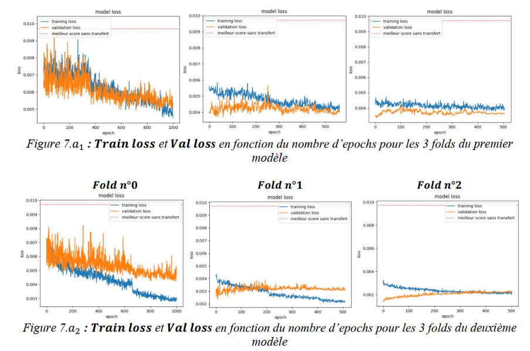 

In all three cases, 𝐹𝑜𝑙𝑑 𝑛°0, 𝐹𝑜𝑙𝑑 𝑛°1 and 𝐹𝑜𝑙𝑑 𝑛°2, the second model of Transfer learning
(Figure 7.𝑎2) has the highest scores. We contact an advantage in the use of diapers
and intermediate weights already trained with the base model. This second model of
Transfer learning significantly improves scores which are all higher than the best
of the three scores of the basic model without Transfer learning (0.0097) for
LUCAS_SOC_Grassland_2867_Nocita

b) 𝑳𝑼𝑪𝑨𝑺_𝒑𝑯_𝑶𝒓𝒈𝒂𝒏𝒊𝒄_𝟏𝟕𝟔𝟒_𝑳𝒊𝒖

    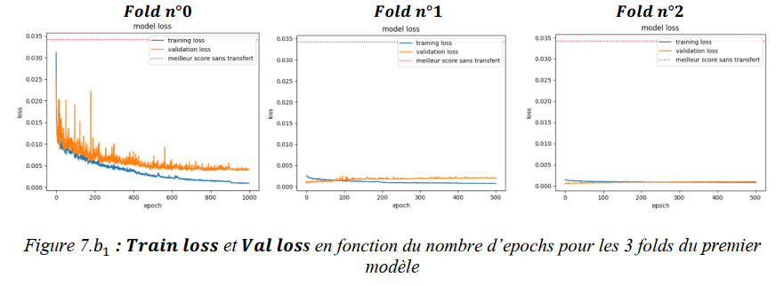 

    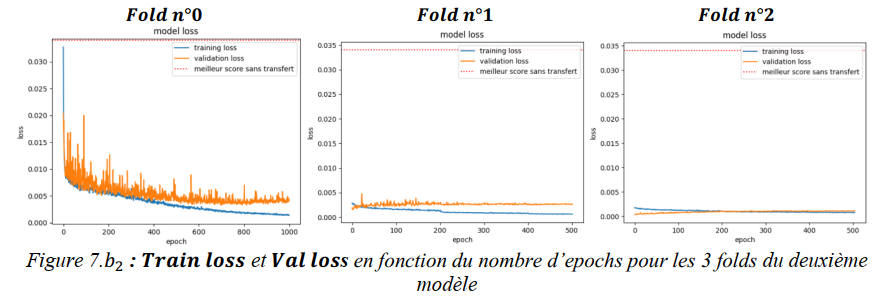 

For LUCAS_pH_Organic_1764_Liu on the other hand, there is not too much improvement in terms of
scores for the two Transfer learning models. The difference between the two curves for the
second model of the reduced 𝐅𝐨𝐥𝐝 𝐧°𝟎, which is not the case with the 𝐅𝐨𝐥𝐝 𝐧°𝟏 of the first model.
The curves of the 𝐅𝐨𝐥𝐝 𝐧°𝟐 in the two cases show no difference in terms of
performance. Overall performance in both Transfer models (0.0011) remains
much larger than those of the basic model without Transfer (0.0034).

c) 𝑳𝑼𝑪𝑨𝑺_𝑺𝑶𝑪_𝑶𝒓𝒈𝒂𝒏𝒊𝒄_𝟑𝟓𝟐𝟖_𝑵𝒐𝒄𝒊𝒕𝒂

    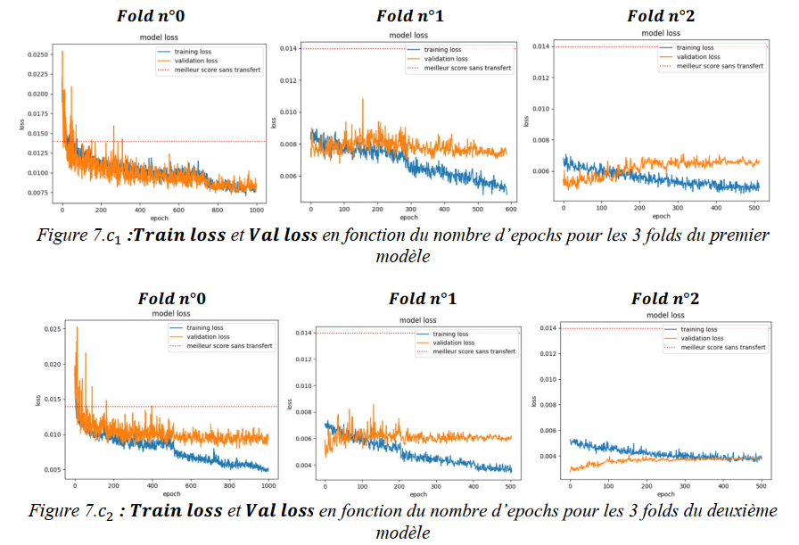 

In all three cases, 𝐹𝑜𝑙𝑑 𝑛°0, 𝐹𝑜𝑙𝑑 𝑛°1 and 𝐹𝑜𝑙𝑑 𝑛°2, the second model of Transfer learning
has the highest scores for 𝐿𝑈𝐶𝐴𝑆_𝑆𝑂𝐶_𝑂𝑟𝑔𝑎𝑛𝑖𝑐_3528_𝑁𝑜𝑐𝑖𝑡𝑎. Hence the advantage of using
layers and intermediate weights already trained with the basic model compared to the layers
entrance. Overall performance in both Transfer models remains more
larger than those of the base model without Transfer (0.0127).

##### 3) Transfer learning while keeping the behind layers:

Here we perform a third Transfer learning while keeping the third layer of
convolution of the basic network without however re-training them, and thereafter we will
comparison with the first two Transfer learning models for each of our three
species. For this third model, we obtain the following curves:

a) 𝑳𝑼𝑪𝑨𝑺_𝑺𝑶𝑪_𝑮𝒓𝒂𝒔𝒔𝒍𝒂𝒏𝒅_𝟐𝟖𝟔𝟕_𝑵𝒐𝒄𝒊𝒕𝒂

     

Here the performance of the 𝑭𝒐𝒍𝒅 𝒏°𝟎 is superior to that of the first two models as well as the
performance of the 𝑭𝒐𝒍𝒅 𝒏°𝟏 and 𝑭𝒐𝒍𝒅 𝒏°𝟐 of the first transfer model. For 𝑭𝒐𝒍𝒅 𝒏°𝟏 and
𝑭𝒐𝒍𝒅 𝒏°𝟐 the second transfer model has the best scores.

b) 𝑳𝑼𝑪𝑨𝑺_𝒑𝑯_𝑶𝒓𝒈𝒂𝒏𝒊𝒄_𝟏𝟕𝟔𝟒_𝑳𝒊𝒖

    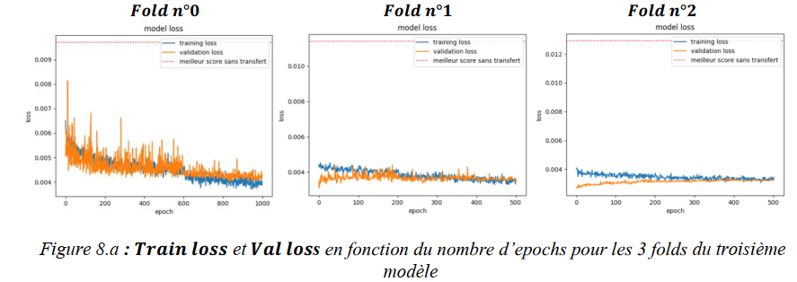 

Here the performance of the 𝑭𝒐𝒍𝒅 𝒏°𝟎 is superior to that of the first two models but
lower than the 𝑭𝒐𝒍𝒅 𝒏°𝟏 of the first transfer model. For the 𝑭𝒐𝒍𝒅 𝒏°𝟏 and 𝑭𝒐𝒍𝒅 𝒏°𝟐 the
second transfer model has the best scores.

c) 𝑳𝑼𝑪𝑨𝑺_𝑺𝑶𝑪_𝑶𝒓𝒈𝒂𝒏𝒊𝒄_𝟑𝟓𝟐𝟖_𝑵𝒐𝒄𝒊𝒕𝒂

    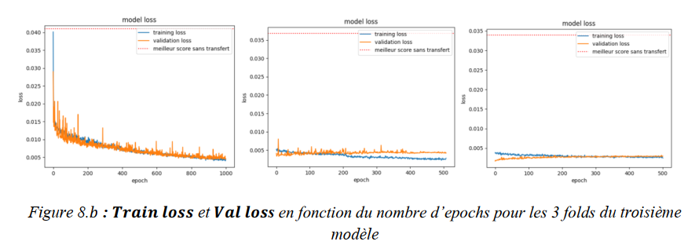 

As for the two previous datasets, the performance of LUCAS_SOC_Organic
_3528_Nocita 𝑭𝒐𝒍𝒅 𝒏°𝟎 for the third model is higher than that of the first two
models. For 𝑭𝒐𝒍𝒅 𝒏°𝟏 and 𝑭𝒐𝒍𝒅 𝒏°𝟐 the second transfer pattern has the best scores.

### Conclusion

This study aimed to implement Transfer Learning and test its effectiveness.
in terms of performance, convergence speed, and robustness and therefore the most
were aimed at testing which are the layers of the convolutional neural network
that we used, the most useful to transfer among the initial, intermediate layers
or finals. To do this, we mainly used the following four datasets
LUCAS_SOC_Cropland_Nocita, LUCAS_SOC_Grassland_Nocita, LUCAS_SOC_Organic_Nocita and
LUCAS_PH_Organic_Liu and sufficiently trained the neural network with this set of
LUCAS_SOC_Cropland_Nocita data as it is the largest dataset and contains more
information. After transferring the weights from our base model and transferring to the
other datasets, we made some observations after measurements of
performance. The three transfer learning models to LUCAS_SOC_Grassland_Nocita,
LUCAS_SOC_Organic_Nocita and LUCAS_PH_Organic_Liu perform better than with the model
without transfer. A comparison between the three Transfer learning models with our three
dataset shows us the best results with the second model (Transfer
learning while keeping the intermediate layers of the pretrained network) in terms of
convergence and performance.

